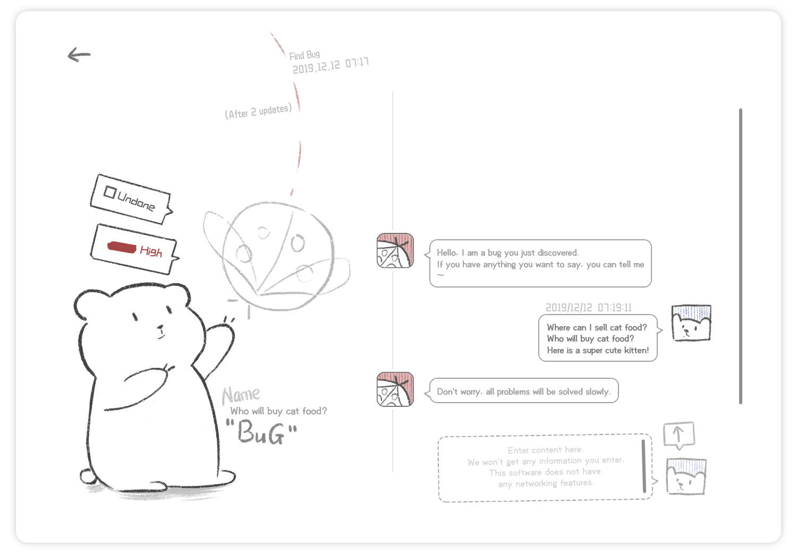

# Easy Bug Manager

<br/>

（中文请点击这里：[中文](Document/ReadMe/ReadMe[CN].md)）

<br/>

<br/>

## Foreword

<br/>


<br/>

Because most of the work in this software is done by one person, the software may have defects or can be improved.

If you have any suggestions or want to submit a bug in the software, please contact me via email : [xudawang@vip.163.com](xudawang@vip.163.com)

Thank you for using this little software, thank you very much again : )

<br/>

<br/>

<br/>

<br/>

## Download

Latest version: v1.0.0.0 (February 07, 2020)

Download link：[Click to download v1.0.0.0 version](https://github.com/xujiangjiang/Easy-Bug-Manager/releases/download/v1.0.0.0/Easy.Bug.Manager.v1.0.0.0.zip)

Steam link : https://store.steampowered.com/app/1175080/Easy_Bug_Manager/

<br/>

<br/>

<br/>

<br/>

## Introduction




<br/>

<u>**Introduction**</u>

```
Easy Bug Manager is a tool for bug management.
```

If you're developing a software, web page, or game, Easy Bug Manager is your best choice to help you manage bugs in your project.
If you're not a developer, you can also use our product as a simple and cute To-do software. It helps you record and manage what you need to do.
If you are an artist, you can also use our software to help you manage your ideas.

<br/>

<u>**Features**</u>

- For free
- Export Excel file
- Two kinds of Themes： Light and Dark
- Two kinds of Languages：English and Chinese
- Simple and easy to use
- Lovely and concise interface
- Designed for individuals or small groups
- A bug be with you ,talk with you

<br/>

<u>**What are the functions of this software?**</u>

It can record and manage bugs in your project.
Step 1: Enter the description of the bug
Step 2: Set the priority of the bug
Step 3: Let’s kill bugs one by one according to the priority!

<br/>

**<u>If you're a programmer</u>**

You can record all bugs in this software and assign priority and schedule for each bug.
Compared with other same type software, our product has the following merits:

- Lovely interface, simple operation.
- In the design of the software, only really useful elements were remained. You do not have to fill in lots of options, but just fill in the name and priority of the bug. Then you can record a bug.
- You do not have to consider for too much. Just simply record the bug, and then solve it.
- To make boring things warm , "Polar Bear Debugging" was added in the software (it is inspired by "Rubber Duck Debugging"). You can type in your thoughts on the bug as if you were chatting with a friend, then the Bug will reply you with its thoughts and encouragement. With friendly chat, your train of thought will be clearer! Isn't it great to debug with chat?

<br/>

**<u>If you're not a programmer</u>**

You can use this software as a To-do software.
Step 1: Enter the things you’re going to do.
Step 2: Set priorities.
Step 3: Let’s get things done one by one according to priorities!
<br/>

**<u>If you're an artist</u>**

If you are an artist, you can also use this software to help you manage your ideas.
Step 1: Enter an idea.
Step 2: Take your time, perfect your idea.
Step 3: Use your idea.

<br/>

<br/>

<br/>

<br/>

## **Feature**

Easy Bug Manager is a WPF application written in C# (.NET Framework) that runs on the Windows platform.

<br/>

**Software features：**

- Very simple
- Very cute
- Support two languages: Chinese, English
- Two Theme: Light and Dark
- Have detailed script comments（Currently only Chinese，Will add English as soon as possible）

<br/>

<br/>

## Project structure

**Folder description:**

| Folder | Description                                                  |
| ------ | ------------------------------------------------------------ |
| Asset  | This folder is all the resources used in the project. Includes images, fonts, and sound files. |
| Code   | This folder is all the C# scripts used in the project.       |
| Xaml   | This folder is all the .xaml files used in the project. Includes custom controls, resource dictionaries, and styles. |

<br/>

**Important File description:**

| Folder          | Description                                                  |
| --------------- | ------------------------------------------------------------ |
| MainWindow.xaml | Main window                                                  |
| AppManager.cs   | Management class (used to manage all windows, logic, and data class objects) |

<br/>

<br/>

<br/>

<br/>

## Cat theme

This software is a small free software.

If you like this software ...

If you want to support the author to continue to maintain this software (and continue to develop new free software) ...

You can buy cat themes for this software.

The cat theme costs $ 1 and includes both light and dark versions.

You can buy it on the Steam Store : https://store.steampowered.com/app/1217970/Easy_Bug_Manager__Cat_Theme/

(Thank you very very very much, thank you very very much!)


<br/>

<br/>

<br/>

<br/>